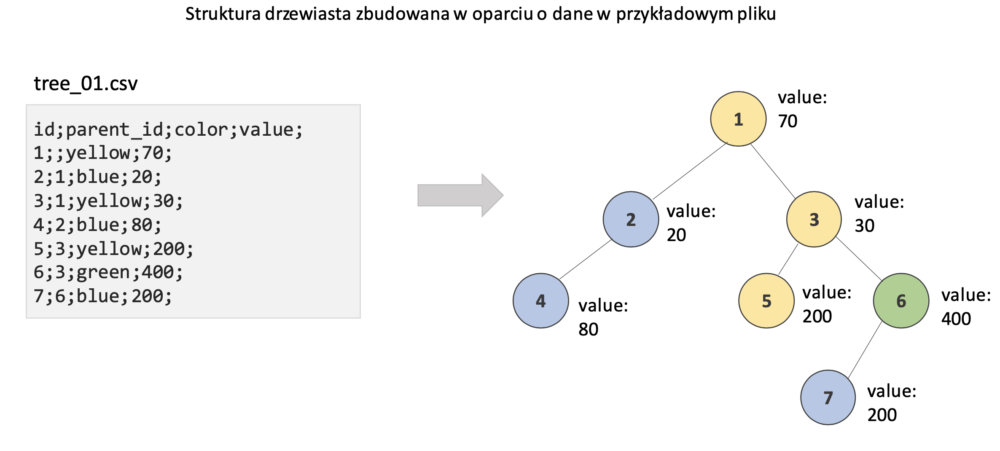
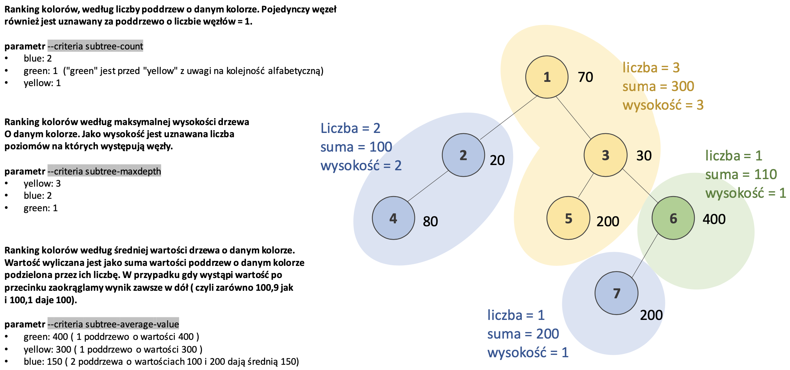

# Ranking kolorów w drzewie

W ramach zadania zaimplementuj możliwy do uruchomienia z wiersza poleceń program
"color_ranking.py" zgodnie z wymaganiami opisanym w dokumencie. Zadaniem programu będzie
zwrócenie rankingu wyliczanego na strukturze drzewiastej opisanej w pliku wejściowym.
Poniżej i na kolejnych stronach określono wymagania.

## Wymagania ogólne

1. Zaimplementuj rozwiązanie w języku python 3.x

2. W wyniku wywołania programu z wiersza poleceń powinien zostać zwrócony ranking
   wyliczany na strukturze drzewiastej przekazanej w pliku. Wywołanie z wiersza poleceń
   powinno przyjmować dwa parametry: _ parametr --file wskazuje lokalizacje pliku CSV,
   który zawiera strukturę drzewa _ parametr --criteria wskazuje sposób obliczania
   rankingu. Parametr może przyjąć 3 wartości opisane na kolejnych stronach. \*
   szczegóły obu parametrów zostały opisane na kolejnych stronach dokumentu

3. Wynik zwracany przez wywołanie powinien zwrócić wynik w postaci listy, krotek
   (`List[Tuple]`) zawierających (kolor, wynik). Gdzie indeks wystąpienia na liście
   oznacza pozycję w rankingu. W przypadku remisu o kolejności decyduje kolejność
   alfabetyczna parametru kolor. \* Przykładowy wynik:
   `[(blue, 100), (green, 80), (yellow, 80)]` oznacza że pierwsze miejsce zajął kolor
   "blue" z wynikiem 100, kolejne kolor "green" z wynikiem 80 a ostatnie "yellow" z
   wynikiem 80. Kolor "green" jest na drugim miejscu przed "yellow" w związku z
   sortowaniem alfabetycznym w przypadku remisu.

4. Zaimplementuj testy jednostkowe przy użyciu pytest weryfikujące poprawność działania
   rozwiązania

5. W przypadku wystąpienia błędów:
   - brak pliku moduł zwróci wyjątek `FileNotFoundError`
   - niepoprawnej struktury pliku moduł zwróci wyjątek `ValueError`
   - niepoprawnych parametrów wywołania moduł zwróci wyjątek `ValueError`
   - błąd powinien zawierać komunikat z informacją o przyczynie błędu

## Struktura pliku zawierającego drzewo

Na wejściu do skryptu w parametrze --file zadania otrzymujesz ścieżkę do pliku CSV. Ten
plik zawiera zapisaną informacje o strukturze drzewiastej zapisaną w postaci pliku csv
rozdzielanego średnikiem o opisanych poniżej kolumnach:

- id – identyfikator węzła
- parent_id – wskazuje na "id" węzła, który jest rodzicem danego węzła
- color – informacja jakiego koloru jest węzeł
- value - wartość węzła

### Dodatkowe informacje:

- Każdy węzeł może mieć wiele dzieci.
- Dla uproszczenia przyjmujemy, że zawartość przekazanego pliku jest poprawna i nie ma
  potrzeby walidować jego struktury pod kątem liczby kolumn, ich kolejności i formatów
  danych w nich występujących.
- Zakładamy, że plik jest na tyle mały iż mieści się w pamięci RAM na lokalnej maszynie
- Zakładamy, że plik nie jest pusty i zawiera przynajmniej jeden wiersz z węzłem "root"
- Zakładamy, że drzewo nie zawiera cykli i nie ma potrzeby walidować pliku na wypadek
  ich występowania

## Przykład

## Sposób weryfikacji rozwiązania

Rozwiązanie będzie testowane na innych przykładach poprzez wywołania załączone poniżej.
Poniższe wywołania dla drzewa na poprzedniej stronie powinny zwrócić wyniki:

Call: `python color_ranking.py --file /path/tree_01.csv --criteria subtree-count`
Result: `[('blue', 2), ('green', 1), ('yellow', 1)]`

Call: `python color_ranking.py --file /path/tree_01.csv --criteria subtree-maxdepth`
Result: `[('yellow', 3), ('blue', 2), ('green', 1)]`

Call:
`python color_ranking.py --file /path/tree_01.csv --criteria subtree-average-value`
Result: `[('green', 400), ('yellow', 300), ('blue', 150)]`
